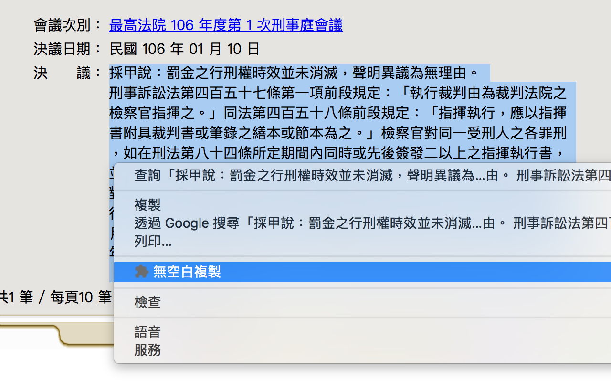

# No Blank Copy

## Usage

1. Download from Chrome WebApp Store. Or clone/git it via GitHub.
2. Install it.
3. Select a paragraph and right click, clicked the 'No Blank Copy' item.
4. Done.

## Intro

This app is made for remove unreasonable blanks in Chinese paragraph.

For example, the following one is a normal paragraph. Applications will indent it automatically.

> 甲經判處有期徒刑十三年，併科罰金新台幣二十萬元，罰金如易服勞役以新台幣一千元折算一日，於民國九十五年九月一日判決確定。經檢察官於九十五年十月一日就有期徒刑部分製作執行指揮書，刑期至一○八年四月二十日期滿（有羈押折抵刑期），嗣於九十六年三月一日製作罰金易服勞役二百日之執行指揮書，接續於有期徒刑執行完畢後自一○八年四月二十一日起執行。甲於一○五年九月一日以罰金之行刑權時效消滅為理由聲明異議。有無理由？

But, in some cases, there are unreasonable blanks(or link breaks) in a paragraph. Such as this following paragraph. The indent is rigid. Then applications will detect it as multiple paragraphs.

> 甲經判處有期徒刑十三年，併科罰金新台幣二十萬元，罰金如易服勞役以
> 新台幣一千元折算一日，於民國九十五年九月一日判決確定。經檢察官於
> 九十五年十月一日就有期徒刑部分製作執行指揮書，刑期至一○八年四月
> 二十日期滿（有羈押折抵刑期），嗣於九十六年三月一日製作罰金易服勞
> 役二百日之執行指揮書，接續於有期徒刑執行完畢後自一○八年四月二十
> 一日起執行。甲於一○五年九月一日以罰金之行刑權時效消滅為理由聲明
> 異議。有無理由？

It hard to reuse. We should make it 'normal' manually, such as do some replacement. It is too tedious. So, I made it.